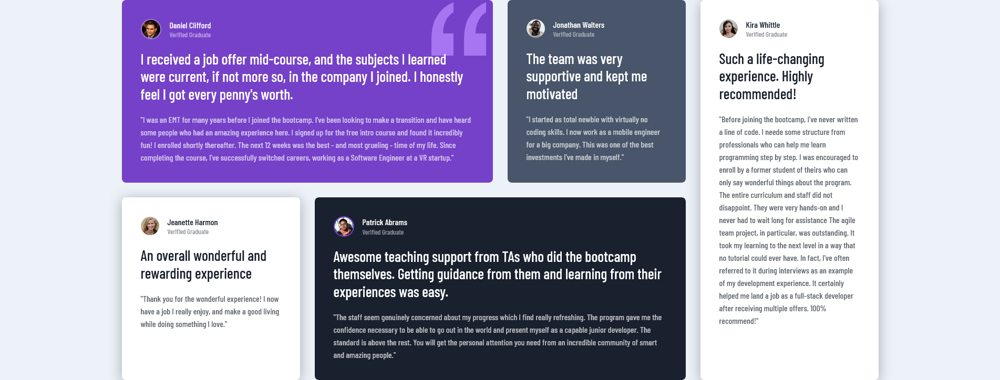

# Frontend Mentor - Testimonials grid section solution

This is a solution to the [Testimonials grid section challenge on Frontend Mentor](https://www.frontendmentor.io/challenges/testimonials-grid-section-Nnw6J7Un7). Frontend Mentor challenges help you improve your coding skills by building realistic projects. 

## Table of contents

- [Overview](#overview)
  - [The challenge](#the-challenge)
  - [Screenshot](#screenshot)
  - [Links](#links)
- [My process](#my-process)
  - [Built with](#built-with)
  - [Useful resources](#useful-resources)
- [Author](#author)

## Overview

### The challenge

Users should be able to:

- View the optimal layout for the site depending on their device's screen size

### Screenshot

### Links

- [Project Repo](https://github.com/Shadowbest/testimonial-cards)
- [Project solution URL](https://shadowbest.github.io/testimonial-cards/)

## My process

### Built with

- Semantic HTML5 markup
- CSS custom properties
- CSS Grid
- Mobile-first workflow

### Useful resources

- [CSS Tricks Grid Guide](https://css-tricks.com/snippets/css/complete-guide-grid/) - This is a good, quick resource and cheatsheet for learning the basics of CSS Grid.
- [MDN CSS Grid Guides](https://developer.mozilla.org/en-US/docs/Web/CSS/CSS_Grid_Layout#guides) - This is an amazing in-depth guide to understand CSS Grid, how it works and its relationship with other layout methods. Fantastic resource!

## Author

- Frontend Mentor - [@Shadowbest](https://www.frontendmentor.io/profile/Shadowbest)

